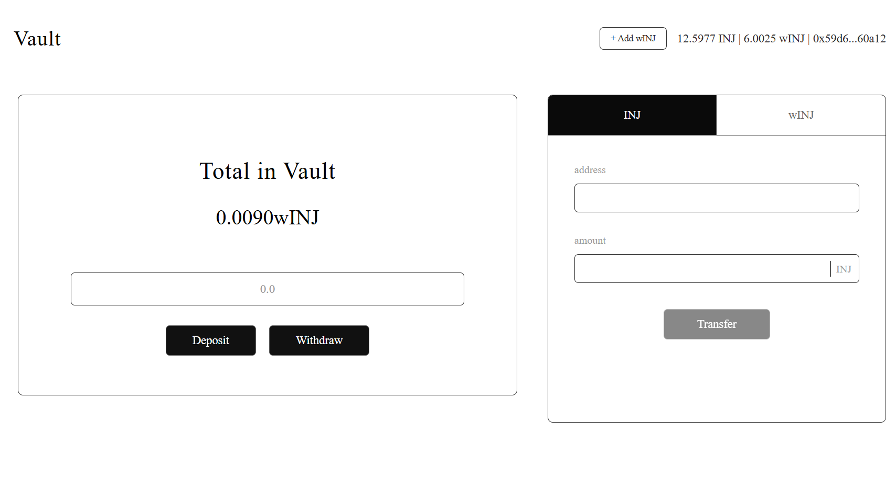

# 🏦 Injective Savings Vault

A decentralized savings vault application built on the Injective EVM testnet, allowing users to securely deposit and withdraw wrapped INJ (wINJ) tokens while maintaining full control of their assets.



## 📋 Table of Contents

- [Overview](#-overview)
- [Features](#-features)
- [Architecture](#️-architecture)
- [Tech Stack](#️-tech-stack)
- [Prerequisites](#-prerequisites)
- [Installation](#-installation)
- [Usage](#-usage)
- [Smart Contract](#-smart-contract)
- [Project Structure](#-project-structure)

## 🌟 Overview

The Injective Savings Vault is a full-stack decentralized application (dApp) that demonstrates secure asset management on the Injective EVM. Users can deposit wINJ tokens into a smart contract vault, track their balance, and withdraw funds at any time. The application also includes functionality for transferring both native INJ and wINJ tokens.

## ✨ Features

### Core Functionality

- 💰 **Secure Deposits**: Deposit wINJ tokens into your personal vault
- 💸 **Instant Withdrawals**: Withdraw your funds at any time with no lockup period
- 📊 **Balance Tracking**: Real-time display of your vault balance
- 🔄 **Token Transfers**: Send INJ or wINJ to any address
- 🔐 **MetaMask Integration**: Seamless wallet connection and transaction signing

### User Experience

- 🎨 Modern, intuitive UI built with React and TypeScript
- ⚡ Real-time balance updates after each transaction
- 📱 Responsive design for desktop and mobile
- 🔔 Transaction status notifications with explorer links
- 🪙 One-click wINJ token addition to MetaMask

## 🏗️ Architecture

The project consists of three main components:

1. **Smart Contract** (`SavingsVault.sol`): Handles deposit, withdrawal, and balance tracking logic
2. **Frontend** (React + TypeScript): User interface for interacting with the vault
3. **Deployment Scripts**: Hardhat scripts for deploying and testing contracts

### How It Works

```text
User Wallet → Approve wINJ → Deposit to Vault → Track Balance → Withdraw Funds
```

1. User connects MetaMask wallet to Injective EVM testnet
2. User approves the vault contract to spend wINJ tokens
3. User deposits wINJ tokens into their personal vault
4. Vault contract tracks individual balances using a mapping
5. User can withdraw any or all of their balance at any time

## 🛠️ Tech Stack

### Smart Contract

- **Solidity** ^0.8.20
- **Hardhat** 2.25.0
- **OpenZeppelin** contracts

### Frontend

- **React** 19.2.0
- **TypeScript** 5.9.3
- **Vite** 7.2.4
- **Ethers.js** 6.15.0

### Network

- **Injective EVM Testnet**
- Chain ID: `0x59f` (1439)
- RPC: `https://k8s.testnet.json-rpc.injective.network/`

## 📦 Prerequisites

Before you begin, ensure you have the following installed:

- **Node.js** (v18 or higher)
- **npm** or **yarn**
- **MetaMask** browser extension
- **Git**

You'll also need:

- Test INJ tokens from the [Injective Testnet Faucet](https://testnet.faucet.injective.network/)
- wINJ tokens (wrapped INJ)

## 🚀 Installation

### 1. Clone the Repository

```bash
git clone https://github.com/Intellihackz/injective-vault-evm.git
cd injective-vault
```

### 2. Install Contract Dependencies

```bash
cd contract
npm install
```

### 3. Install Frontend Dependencies

```bash
cd ../frontend
npm install
```

### 4. Configure Environment Variables

Create a `.env` file in the `contract` directory:

```env
PRIVATE_KEY=your_wallet_private_key_here
INJECTIVE_RPC_URL=https://k8s.testnet.json-rpc.injective.network/
```

> ⚠️ **Security Warning**: Never commit your `.env` file or share your private key!

## 💻 Usage

### Compile Smart Contracts

```bash
cd contract
npx hardhat compile
```

### Deploy to Injective Testnet

```bash
npx hardhat run script/deploy.js --network inj_testnet 
```

After deployment, update the contract addresses in `frontend/src/App.tsx`:

- `VAULT_CONTRACT_ADDRESS`: Your deployed vault address
- `WINJ_CONTRACT_ADDRESS`: wINJ token address (already configured for testnet)

### Run Frontend Development Server

```bash
cd frontend
npm run dev
```

The application will be available at `http://localhost:5173`

### Connect Your Wallet

1. Open the app in your browser
2. Click "Connect" in the top right
3. Approve the MetaMask connection
4. Switch to Injective EVM testnet (automatic prompt)
5. Approve wINJ spending for the vault contract

### Use the Vault

**Deposit:**

1. Enter the amount of wINJ to deposit
2. Click "Deposit"
3. Confirm the transaction in MetaMask

**Withdraw:**

1. Enter the amount to withdraw
2. Click "Withdraw"
3. Confirm the transaction in MetaMask

**Transfer:**

1. Switch to INJ or wINJ tab
2. Enter recipient address and amount
3. Click "Transfer"
4. Confirm the transaction

## 📂 Project Structure

```text
injective-vault/
├── contract/
│   ├── contracts/
│   │   └── SavingsVault.sol      # Main vault contract
│   ├── scripts/
│   │   └── deploy.js              # Deployment script
│   ├── test/
│   │   └── SavingsVault.test.js   # Contract tests
│   ├── hardhat.config.js          # Hardhat configuration
│   └── package.json
├── frontend/
│   ├── src/
│   │   ├── App.tsx                # Main application component
│   │   ├── App.css                # Styling
│   │   ├── abis/                  # Contract ABIs
│   │   └── assets/                # Static assets
│   ├── vite.config.ts             # Vite configuration
│   └── package.json
├── assets/
│   └── architecture.png           # Architecture diagram
├── tutorial/
│   ├── 0-setup.md                 # Setup & Introduction
│   ├── 1-contract.md              # Smart Contract
│   └── 2-frontend.md              # Frontend Application
└── README.md                       # This file
```

## 🔍 Key Files

- **`contract/contracts/SavingsVault.sol`**: The vault smart contract
- **`frontend/src/App.tsx`**: React application with wallet integration
- **`contract/scripts/deploy.js`**: Contract deployment script
- **`contract/hardhat.config.js`**: Network and compiler configuration

## 🧪 Testing

Run contract tests:

```bash
cd contract
npx hardhat test --network inj_testnet
```

## 🌐 Network Configuration

### Injective EVM Testnet

- **Chain ID**: 1439 (0x59f)
- **RPC URL**: <https://k8s.testnet.json-rpc.injective.network/>
- **Block Explorer**: <https://testnet.blockscout.injective.network/>
- **Faucet**: <https://testnet.faucet.injective.network/>

### MetaMask Setup

The application will automatically prompt you to add the Injective EVM testnet to MetaMask on first connection.

Built with ❤️ on Injective EVM
