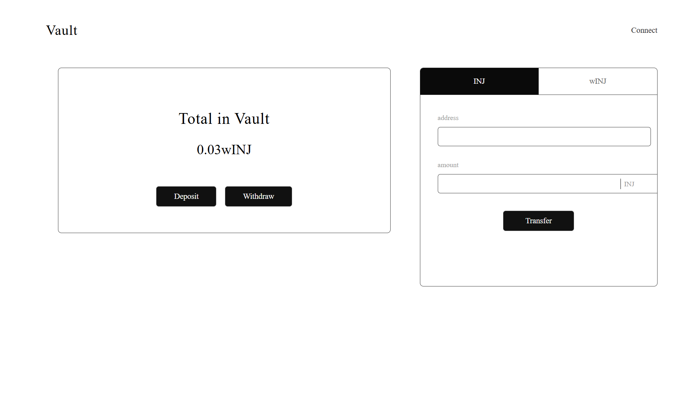
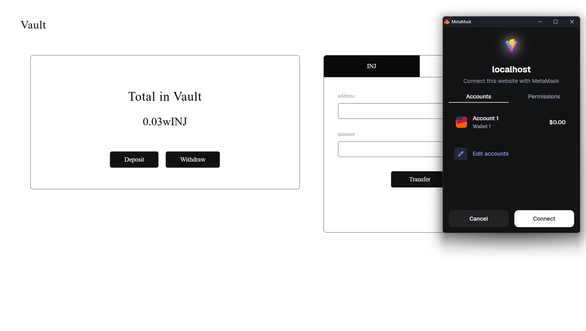
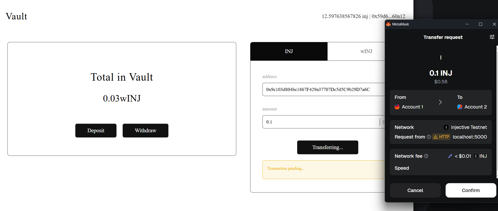
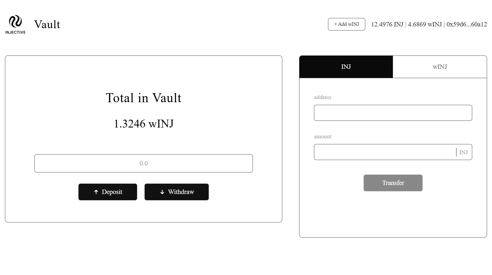

# Building a Savings Vault DApp on Injective EVM

Welcome! In this  tutorial, we're going to build a fully functional savings vault  on Injective EVM . By the end, you'll have written and deployed your own smart contracts, built a React frontend, and connected everything together into a production-ready DApp where users can deposit tokens, withdraw from a vault, and transfer assets - all through their MetaMask wallet.

## Table of Contents

* [Prerequisites](#prerequisites)
* [Complete Code Repository](#complete-code-repository)
* [What We're Building](#what-were-building)
* [How This Will Work](#how-this-will-work)
* [Ready to Build?](#ready-to-build)
* [Project Setup](#project-setup)
* [Part 1: Smart Contract Development](#part-1-smart-contract-development)
  * [Writing the Vault Contract](#writing-the-vault-contract)
  * [Testing Our Contracts](#testing-our-contracts)
  * [Deploying to Testnet](#deploying-to-testnet)
* [Part 2: Frontend Development](#part-2-frontend-development)
  * [Setting Up React with TypeScript](#setting-up-react-with-typescript)
  * [Project Structure](#project-structure)
  * [Building the UI First](#building-the-ui-first)
  * [Setting Up TypeScript Interfaces](#setting-up-typescript-interfaces)
  * [Creating the Main Component](#creating-the-main-component)
  * [Building the UI Structure](#building-the-ui-structure)
  * [Understanding the UI Components](#understanding-the-ui-components)
  * [Adding the CSS](#adding-the-css)
  * [Running the UI](#running-the-ui)

## Prerequisites

Before we dive in, let's make sure you have everything you need. Don't worry - we'll keep things practical and I'll explain everything along the way:

### Required Tools

* **Node.js 18+** - We'll be using modern JavaScript features
* **MetaMask wallet** - Install the browser extension if you haven't already
* **Code editor** - VS Code is great and has excellent Solidity support
* **Git** - For version control and cloning repositories
* **Some testnet INJ** - We'll show you how to get this from the faucet
* **Some testnet wINJ** - We'll show you how to get this too

### Required Knowledge

* **Basic Solidity** - You should understand variables, functions, and modifiers
* **React fundamentals** - Comfortable with hooks, state, and useEffect
* **TypeScript basics** - Helpful but not required; I'll explain as we go

## Complete Code Repository

📁 **View the complete source code on GitHub** [https://github.com/Intellihackz/injective-vault-evm]

### 📖 How to Use This Tutorial

This tutorial can be used in two ways:

1. **Learning Mode** - Follow along step-by-step and build everything from scratch to deeply understand how each piece works
2. **Reference Mode** - If you've cloned the completed repository, use this tutorial to understand the implementation details and design decisions

## What We're Building

Here's what our Savings Vault DApp will be able to do by the end of this tutorial:

### Smart Contract Features

* **Secure Vault Contract** - Holds user deposits with proper access controls
* **wINJ Integration** - Works with wrapped INJ tokens (ERC20)
* **Deposit Function** - Users can deposit wINJ into the vault
* **Withdraw Function** - Users can withdraw their deposited tokens
* **Balance Tracking** - Track individual user balances in the vault

### Frontend Features

* **MetaMask Connection** - Seamless wallet integration with network switching
* **Token Approval Flow** - User-friendly approval process for wINJ spending
* **Real-time Balances** - Live updates of INJ, wINJ, and vault balances
* **Deposit Interface** - Simple form to deposit tokens into vault
* **Withdraw Interface** - Easy withdrawal of tokens from vault
* **Transfer Functionality** - Send INJ/wINJ to other addresses

## How This Will Work

Let me quickly break down what we're building:

### The Tech Stack

#### Smart Contracts (Solidity)

* Vault Contract - Our custom contract that holds user deposits
* wINJ Token - Pre-deployed ERC20 token (Wrapped INJ)
* Hardhat - Development framework for testing and deployment

#### Frontend (React + TypeScript)

* React - For building our user interface
* ethers.js v6 - For blockchain interactions
* TypeScript - For type safety
* Plain CSS - For styling

#### Infrastructure

* Injective EVM Testnet - Where we'll deploy and test everything
* MetaMask - Handles wallet connection and transaction signing
* BlockScout Explorer - For viewing transactions and verifying contracts

## Ready to Build?

Alright, enough introduction - let's start building something awesome!

In the next section, we'll set up our project structure with both the smart contracts and frontend in one organized workspace. By the time we're done, you'll have a complete, working DApp that you can actually use and show off.

Let's go! 🚀

---

## Project Setup

Before we dive into smart contracts or frontend code, let's set up our project structure properly. We'll create a parent folder that contains both our contracts and frontend as separate packages.

### Creating the Project Structure

First, create a new directory for the entire project:

```bash
mkdir injective-vault
cd injective-vault
```

Now let's set up the contract folder using Injective's Hardhat template:

```bash
git clone https://github.com/InjectiveLabs/injective-hardhat-template.git contract
cd contract
npm install --force
```

This gives us a pre-configured Hardhat setup optimized for Injective EVM, including:

* Hardhat configuration for Injective networks
* Sample contract structure
* Testing setup
* Deployment scripts

### Understanding the Hardhat Configuration

The cloned template already comes with a configured `hardhat.config.js` file. Let's understand what each part does:

```javascript
require('@nomicfoundation/hardhat-toolbox');
require('dotenv').config();

/** @type import('hardhat/config').HardhatUserConfig */
module.exports = {
  solidity: '0.8.28',
  networks: {
    inj_testnet: {
      url: process.env.INJ_TESTNET_RPC_URL || 'https://k8s.testnet.json-rpc.injective.network/',
      accounts: process.env.PRIVATE_KEY ? [process.env.PRIVATE_KEY] : [],
      chainId: 1439,
      gas: 10000000,
      gasPrice: 50000000000,
    },
  },
  etherscan: {
    apiKey: {
      inj_testnet: 'nil',
    },
    customChains: [
      {
        network: 'inj_testnet',
        chainId: 1439,
        urls: {
          apiURL: 'https://testnet.blockscout-api.injective.network/api',
          browserURL: 'https://testnet.blockscout.injective.network/',
        },
      },
    ],
  },
  sourcify: {
    enabled: false,
  },
};
```

## Configuration Breakdown

### Solidity Version

```javascript
solidity: '0.8.28',
```

The Solidity compiler version we'll use for our contracts.

### Network Configuration

```javascript
networks: {
  inj_testnet: {
    url: process.env.INJ_TESTNET_RPC_URL || 'https://k8s.testnet.json-rpc.injective.network/',
    accounts: process.env.PRIVATE_KEY ? [process.env.PRIVATE_KEY] : [],
    chainId: 1439,
    gas: 10000000,
    gasPrice: 50000000000,
  },
}
```

* **url**: The RPC endpoint for Injective EVM testnet
* **accounts**: Your wallet's private key (loaded from .env)
* **chainId**: Injective EVM testnet chain ID (1439)
* **gas**: Gas limit for transactions
* **gasPrice**: Gas price in wei

### Contract Verification

```javascript
etherscan: {
  apiKey: {
    inj_testnet: 'nil',
  },
  customChains: [
    {
      network: 'inj_testnet',
      chainId: 1439,
      urls: {
        apiURL: 'https://testnet.blockscout-api.injective.network/api',
        browserURL: 'https://testnet.blockscout.injective.network/',
      },
    },
  ],
},
```

This configuration allows us to verify our contracts on BlockScout (Injective's block explorer) after deployment.

### Setting Up Environment Variables

Create a `.env` file in the contracts folder:

Add your private key and rpc url:

```env
PRIVATE_KEY=your_private_key_here
INJ_TESTNET_RPC_URL=https://k8s.testnet.json-rpc.injective.network/
```

**⚠️ Important Security Notes:**

1. **Never commit your `.env` file to git!** The template's `.gitignore` already excludes it
2. **Use a testnet-only wallet** - Never use your mainnet wallet's private key
3. **Get your private key from MetaMask**:
   * Open MetaMask
   * Click the three dots → Account Details → Export Private Key
   * Enter your password and copy the key

Now we're ready to write our contract!

## Part 1: Smart Contract Development

Now that our environment is set up, let's write our Vault contract! This contract will allow users to safely deposit and withdraw wINJ tokens.

### Writing the Vault Contract

Navigate to the `contract/contracts` folder and create a new file called `SavingsVault.sol`:

Here's our complete vault contract:

```solidity
// SPDX-License-Identifier: MIT
pragma solidity ^0.8.20;

interface IERC20 {
    function transferFrom(address from, address to, uint256 amount) external returns (bool);
    function transfer(address to, uint256 amount) external returns (bool);
    function approve(address spender, uint256 amount) external returns (bool);
    function balanceOf(address account) external view returns (uint256);
}

contract SavingsVault {
    IERC20 public immutable wINJ;

    mapping(address => uint256) private balances;

    event Deposited(address indexed user, uint256 amount);
    event Withdrawn(address indexed user, uint256 amount);

    constructor(address _wINJ) {
        wINJ = IERC20(_wINJ);
    }

    function deposit(uint256 amount) external {
        require(amount > 0, "amount=0");
        require(wINJ.transferFrom(msg.sender, address(this), amount), "transferFrom failed");

        balances[msg.sender] += amount;
        emit Deposited(msg.sender, amount);
    }

    function withdraw(uint256 amount) external {
        require(amount > 0, "amount=0");
        require(balances[msg.sender] >= amount, "insufficient balance");

        balances[msg.sender] -= amount;
        require(wINJ.transfer(msg.sender, amount), "transfer failed");

        emit Withdrawn(msg.sender, amount);
    }

    function myBalance() external view returns (uint256) {
        return balances[msg.sender];
    }
}
```

### Understanding the Contract

Let's break down what each part does:

#### The IERC20 Interface

```solidity
interface IERC20 {
    function transferFrom(address from, address to, uint256 amount) external returns (bool);
    function transfer(address to, uint256 amount) external returns (bool);
    function approve(address spender, uint256 amount) external returns (bool);
    function balanceOf(address account) external view returns (uint256);
}
```

This interface defines the ERC20 token functions we'll use. We only include the functions we need - `transferFrom` for deposits and `transfer` for withdrawals. This keeps our contract simple and gas-efficient.

#### State Variables

```solidity
IERC20 public immutable wINJ;
mapping(address => uint256) private balances;
```

* **`wINJ`**: An immutable reference to the wINJ token contract. We use `immutable` because this address never changes after deployment, which saves gas on reads.
* **`balances`**: A mapping that tracks how much each user has deposited. We use `private` visibility since we provide a public getter function.

#### Events

```solidity
event Deposited(address indexed user, uint256 amount);
event Withdrawn(address indexed user, uint256 amount);
```

Events are crucial for off-chain applications. They allow our frontend to:

* Track deposit and withdrawal history
* Show real-time notifications
* Build transaction logs

The `indexed` keyword on the `user` parameter lets us filter events by user address efficiently.

#### Constructor

```solidity
constructor(address _wINJ) {
    wINJ = IERC20(_wINJ);
}
```

When we deploy the contract, we pass in the wINJ token address. On Injective EVM testnet, this is `0x0000000088827d2d103ee2d9A6b781773AE03FfB`.

#### Deposit Function

```solidity
function deposit(uint256 amount) external {
    require(amount > 0, "amount=0");
    require(wINJ.transferFrom(msg.sender, address(this), amount), "transferFrom failed");

    balances[msg.sender] += amount;
    emit Deposited(msg.sender, amount);
}
```

Here's what happens when a user deposits:

1. **Validation**: We check that the amount is greater than 0
2. **Transfer**: We use `transferFrom` to move tokens from the user to the vault. This requires the user to have approved the vault first (we'll handle this in the frontend)
3. **Update Balance**: We add the amount to the user's balance
4. **Emit Event**: We emit a `Deposited` event for off-chain tracking

#### Withdraw Function

```solidity
function withdraw(uint256 amount) external {
    require(amount > 0, "amount=0");
    require(balances[msg.sender] >= amount, "insufficient balance");

    balances[msg.sender] -= amount;
    require(wINJ.transfer(msg.sender, amount), "transfer failed");

    emit Withdrawn(msg.sender, amount);
}
```

The withdrawal process:

1. **Validate Amount**: Check that amount > 0
2. **Check Balance**: Ensure the user has enough deposited
3. **Update State**: Reduce the user's balance BEFORE transferring (prevents reentrancy)
4. **Transfer**: Send tokens back to the user
5. **Emit Event**: Record the withdrawal

#### Balance Query Function

```solidity
function myBalance() external view returns (uint256) {
    return balances[msg.sender];
}
```

A simple view function that returns the caller's balance. View functions don't cost gas when called off-chain, making them perfect for UI updates.

### Compiling the Contract

Let's make sure our contract compiles without errors:

```bash
npx hardhat compile
```

You should see:

```bash
Compiled 1 Solidity file successfully
```

If you see any errors, double-check your code matches exactly.

Now that we have our contract written and compiled, we need to test it

### Testing Our Contracts

Now let's write tests to make sure our vault works correctly. Create a new file `SavingsVault.test.js` in the `test` folder:

Here's our test suite:

```javascript
const { expect } = require("chai");
const { ethers } = require("hardhat");

describe("SavingsVault", function () {
  let signer;
  let vault, wINJ;
  const depositAmount = ethers.parseUnits("0.01");

  before(async () => {
    [signer] = await ethers.getSigners();

    // Load wINJ
    const wINJ_ADDRESS = "0x0000000088827d2d103ee2d9A6b781773AE03FfB";

    wINJ = await ethers.getContractAt(
      "IERC20",
      wINJ_ADDRESS,
      signer
    );

    // Deploy vault
    const Vault = await ethers.getContractFactory("SavingsVault", signer);
    vault = await Vault.deploy(wINJ_ADDRESS);
    await vault.waitForDeployment();

    console.log("Vault deployed to:", await vault.getAddress());
  });

  it("should allow deposit", async () => {
    const vaultAddress = await vault.getAddress();

    // approve
    await wINJ.approve(vaultAddress, depositAmount);

    // deposit
    await expect(vault.deposit(depositAmount))
      .to.emit(vault, "Deposited")
      .withArgs(signer.address, depositAmount);

    expect(await vault.myBalance()).to.equal(depositAmount);
  });

  it("should allow withdrawal", async () => {
    await expect(vault.withdraw(depositAmount))
      .to.emit(vault, "Withdrawn")
      .withArgs(signer.address, depositAmount);

    expect(await vault.myBalance()).to.equal(0);
  });
});
```

### Understanding the Tests

Let's break down what our test suite does:

#### Test Setup

```javascript
let signer;
let vault, wINJ;
const depositAmount = ethers.parseUnits("0.01");
```

We declare variables for:

* **signer**: The account that will interact with the contracts
* **vault**: Our SavingsVault contract instance
* **wINJ**: The wINJ token contract instance
* **depositAmount**: 0.01 wINJ (converted to wei using `parseUnits`)

#### Before Hook - Deployment

```javascript
before(async () => {
  [signer] = await ethers.getSigners();

  const wINJ_ADDRESS = "0x0000000088827d2d103ee2d9A6b781773AE03FfB";

  wINJ = await ethers.getContractAt(
    "IERC20",
    wINJ_ADDRESS,
    signer
  );

  const Vault = await ethers.getContractFactory("SavingsVault", signer);
  vault = await Vault.deploy(wINJ_ADDRESS);
  await vault.waitForDeployment();

  console.log("Vault deployed to:", await vault.getAddress());
});
```

The `before` hook runs once before all tests:

1. Gets a signer from Hardhat
2. Connects to the existing wINJ token contract on testnet
3. Deploys our SavingsVault contract
4. Waits for deployment to complete

#### Test 1: Deposit

```javascript
it("should allow deposit", async () => {
  const vaultAddress = await vault.getAddress();

  // approve
  await wINJ.approve(vaultAddress, depositAmount);

  // deposit
  await expect(vault.deposit(depositAmount))
    .to.emit(vault, "Deposited")
    .withArgs(signer.address, depositAmount);

  expect(await vault.myBalance()).to.equal(depositAmount);
});
```

This test verifies the deposit flow:

1. Approve the vault to spend wINJ
2. Call deposit and check that the `Deposited` event is emitted with correct parameters
3. Verify that `myBalance()` returns the deposited amount

#### Test 2: Withdrawal

```javascript
it("should allow withdrawal", async () => {
  await expect(vault.withdraw(depositAmount))
    .to.emit(vault, "Withdrawn")
    .withArgs(signer.address, depositAmount);

  expect(await vault.myBalance()).to.equal(0);
});
```

This test verifies the withdrawal flow:

1. Withdraw the deposited amount
2. Check that the `Withdrawn` event is emitted correctly
3. Verify that the balance is now 0

### Running Tests on Injective EVM Testnet

Unlike typical Hardhat tests that run on a local simulated blockchain, we need to run these tests on the actual Injective EVM testnet. This is because we're interacting with the real wINJ token contract.

Before running tests, make sure you have:

1. Added your private key to `.env` file
2. Some testnet INJ for gas fees
3. Some testnet wINJ tokens in your account

Run the tests with:

```bash
npx hardhat test --network inj_testnet
```

You should see output like:

```bash
  SavingsVault
Vault deployed to: 0x... (your deployed address)
    ✓ should allow deposit
    ✓ should allow withdrawal

  2 passing
```

### Getting Testnet Tokens

If you don't have testnet tokens yet:

1. **Get testnet INJ**: Visit the [Injective testnet faucet](https://testnet.faucet.injective.network/)
2. **Get testnet wINJ**:
   * Use the wINJ contract's `deposit()` function to wrap your INJ
   * Or interact with it through a testnet interface on thr explorer

### What the Tests Verify

Our test suite confirms that:

* ✅ Users can approve and deposit wINJ tokens
* ✅ The vault correctly tracks user balances
* ✅ Events are emitted with correct parameters
* ✅ Users can withdraw their deposited tokens
* ✅ Balances update correctly after withdrawals

These tests give us confidence that our contract works as expected before we deploy it for real users.

### Deploying to Testnet

Now that our contract is tested and working, let's deploy it to Injective EVM testnet so we can interact with it from our frontend.

#### Creating the Deployment Script

Create a new file `scripts/deploy.js`:

```javascript
async function main() {
    const network = await ethers.provider.getNetwork();
    console.log(`Deploying to network: ${network.name} (chainId: ${network.chainId})`);
    
    // wINJ token address on Injective testnet
    const WINJ_ADDRESS = process.env.WINJ_ADDRESS || '0x0000000088827d2d103ee2d9A6b781773AE03FfB';
    
    console.log(`Using wINJ token address: ${WINJ_ADDRESS}`);
    
    // Get the deployer account
    const [deployer] = await ethers.getSigners();
    console.log(`Deploying contracts with account: ${deployer.address}`);
    
    const balance = await ethers.provider.getBalance(deployer.address);
    console.log(`Account balance: ${ethers.formatEther(balance)} INJ`);
    
    // Deploy SavingsVault
    console.log('\nDeploying SavingsVault...');
    const SavingsVault = await ethers.getContractFactory('SavingsVault');
    const savingsVault = await SavingsVault.deploy(WINJ_ADDRESS, {
        gasPrice: 160e6,
        gasLimit: 2e6,
    });
    
    await savingsVault.waitForDeployment();
    const address = await savingsVault.getAddress();
    
    console.log('\n✅ SavingsVault deployed successfully!');
    console.log(`Contract address: ${address}`);
    console.log(`wINJ token: ${WINJ_ADDRESS}`);
    console.log(`\nVerify with: npx hardhat verify --network inj_testnet ${address} ${WINJ_ADDRESS}`);
}

main()
    .then(() => {
        console.log('\n✅ Deployment script executed successfully.');
        process.exit(0);
    })
    .catch((error) => {
        console.error('\n❌ Deployment failed:');
        console.error(error);
        process.exitCode = 1;
    });
```

#### Understanding the Deployment Script

Let's break down what this script does:

#### Network Information

```javascript
const network = await ethers.provider.getNetwork();
console.log(`Deploying to network: ${network.name} (chainId: ${network.chainId})`);
```

This confirms which network we're deploying to - important to avoid accidental mainnet deployments!

#### wINJ Address Configuration

```javascript
const WINJ_ADDRESS = process.env.WINJ_ADDRESS || '0x0000000088827d2d103ee2d9A6b781773AE03FfB';
```

We load the wINJ address from environment variables, with a fallback to the known testnet address.

#### Deployer Information

```javascript
const [deployer] = await ethers.getSigners();
console.log(`Deploying contracts with account: ${deployer.address}`);

const balance = await ethers.provider.getBalance(deployer.address);
console.log(`Account balance: ${ethers.formatEther(balance)} INJ`);
```

This shows which account is deploying and checks if you have enough INJ for gas fees.

#### Contract Deployment

```javascript
const SavingsVault = await ethers.getContractFactory('SavingsVault');
const savingsVault = await SavingsVault.deploy(WINJ_ADDRESS, {
    gasPrice: 160e6,
    gasLimit: 2e6,
});
```

We specify:

* **gasPrice**: 160 Gwei - appropriate for Injective EVM testnet
* **gasLimit**: 2 million gas - plenty for our contract deployment

#### Deployment Confirmation

```javascript
await savingsVault.waitForDeployment();
const address = await savingsVault.getAddress();
```

We wait for the transaction to be mined and get the deployed contract address.

#### Adding wINJ Address to .env

Update your `.env` file to include the wINJ address:

```env
PRIVATE_KEY=your_private_key_here
INJ_TESTNET_RPC_URL=https://k8s.testnet.json-rpc.injective.network/
WINJ_ADDRESS=0x0000000088827d2d103ee2d9A6b781773AE03FfB
```

#### Running the Deployment

Make sure you have:

1. ✅ Testnet INJ for gas fees
2. ✅ Your private key in `.env`
3. ✅ The RPC URL in `.env`
4. ✅ The wINJ address in `.env`

Deploy the contract:

```bash
npx hardhat run scripts/deploy.js --network inj_testnet
```

You should see output like:

```bash
Deploying to network: inj_testnet (chainId: 1439)
Using wINJ token address: 0x0000000088827d2d103ee2d9A6b781773AE03FfB
Deploying contracts with account: 0x742d35Cc6634C0532925a3b844Bc9e7595f0bEb
Account balance: 5.0 INJ

Deploying SavingsVault...

✅ SavingsVault deployed successfully!
Contract address: 0x...
wINJ token: 0x0000000088827d2d103ee2d9A6b781773AE03FfB

Verify with: npx hardhat verify --network inj_testnet <YOUR_CONTRACT_ADDRESS> 0x0000000088827d2d103ee2d9A6b781773AE03FfB

✅ Deployment script executed successfully.
```

**🎉 Save your contract address!** You'll need it for the frontend.

#### Verifying the Contract

After deployment, verify your contract on BlockScout using the command provided in the output:

```bash
npx hardhat verify --network inj_testnet <YOUR_CONTRACT_ADDRESS> 0x0000000088827d2d103ee2d9A6b781773AE03FfB
```

Replace `<YOUR_CONTRACT_ADDRESS>` with the address from your deployment output.

You should see:

```bash
Successfully verified contract SavingsVault on BlockScout.
https://testnet.blockscout.injective.network/address/<YOUR_CONTRACT_ADDRESS>#code
```

#### Viewing Your Contract

Visit BlockScout to see your deployed contract:

```bash
https://testnet.blockscout.injective.network/address/<YOUR_CONTRACT_ADDRESS>
```

You should see:

* ✅ Contract verified (green checkmark)
* ✅ Source code visible under "Code" tab
* ✅ Read/Write contract functions available

Congratulations! Your vault contract is now live on Injective EVM testnet. In the next part, we'll build the frontend to interact with it.

---

## Part 2: Frontend Development

Now that our smart contract is deployed and verified, let's build a beautiful React frontend that allows users to interact with our vault through their MetaMask wallet.

### Setting Up React with TypeScript

Navigate back to the root of your project (the `injective-vault` folder) and create the frontend:

```bash
cd ..  # Go back to injective-vault folder
npm create vite@latest frontend
cd frontend
npm install ethers
```

This creates a new React app with TypeScript support and installs ethers.js for blockchain interactions.

Your project structure should now look like:

```
injective-vault/
├── contracts/          # Smart contracts (done!)
└── frontend/           # React app (we're here)
```

### Project Structure

Let's organize our frontend properly. Here's the structure we'll create:

```
frontend/
├── src/
│   ├── App.tsx         # Main app component
│   ├── App.css         # Styling
│   └── abis/           # Contract ABIs
│       └── SavingsVault.json
├── public/
└── package.json
```

### Building the UI First

We'll start by building the complete user interface with mock data and state management, then add blockchain functionality later.

### Setting Up TypeScript Interfaces

Open `src/App.tsx` and let's create our state interface first:

```typescript
import { useState } from "react";
import "./App.css";

interface VaultState {
  totalBalance: number;
  injBalance: number;
  winjBalance: number;
  address: string;
  amount: string;
}
```

This interface defines all the state we'll need to track:

* **totalBalance**: Total wINJ in the vault
* **injBalance**: User's INJ balance
* **winjBalance**: User's wINJ balance
* **address**: Recipient address for transfers
* **amount**: Amount to transfer

### Creating the Main Component

Now let's build the component with all our state and handlers:

```typescript
function App() {
  const [isConnected, setIsConnected] = useState(false);
  const [walletAddress, setWalletAddress] = useState("");
  const [state, setState] = useState<VaultState>({
    totalBalance: 0.03,
    injBalance: 0,
    winjBalance: 0.03,
    address: "",
    amount: "",
  });

  const handleConnect = () => {
    // Simulate wallet connection (we'll implement real connection later)
    setIsConnected(true);
    setWalletAddress("inj1a2b3c4d5e6f7g8h9i0j1k2l3m4n5o6p7q8r9s0");
  };

  const handleDisconnect = () => {
    setIsConnected(false);
    setWalletAddress("");
  };

  const truncateAddress = (addr: string) => {
    if (!addr) return "";
    return `${addr.slice(0, 6)}...${addr.slice(-5)}`;
  };

  const [activeTab, setActiveTab] = useState<"INJ" | "wINJ">("INJ");

  const handleDeposit = () => {
    console.log("Deposit clicked");
  };

  const handleWithdraw = () => {
    console.log("Withdraw clicked");
  };

  const handleTransfer = () => {
    console.log("Transfer:", { address: state.address, amount: state.amount });
  };
```

Right now these are just placeholder functions that log to the console. We'll implement the real blockchain interactions later.

### Building the UI Structure

Now let's create the complete UI:

```typescript
  return (
    <div className="vault-container">
      <div className="vault-header">
        <h1 className="vault-title">Vault</h1>
        {!isConnected ? (
          <div className="wallet-info" onClick={handleConnect}>
            Connect
          </div>
        ) : (
          <div className="wallet-info" onClick={handleDisconnect}>
            {truncateAddress(walletAddress)}
          </div>
        )}
      </div>

      <div className="vault-content">
        <div className="left-panel">
          <div className="balance-section">
            <h2 className="total-title">Total in Vault</h2>
            <div className="total-amount">
              {state.totalBalance.toFixed(2)}wINJ
            </div>

            <div className="button-group">
              <button className="action-button" onClick={handleDeposit}>
                Deposit
              </button>
              <button className="action-button" onClick={handleWithdraw}>
                Withdraw
              </button>
            </div>
          </div>
        </div>

        <div className="right-panel">
          <div className="tab-header">
            <button
              className={`tab ${activeTab === "INJ" ? "active" : ""}`}
              onClick={() => setActiveTab("INJ")}
            >
              INJ
            </button>
            <button
              className={`tab ${activeTab === "wINJ" ? "active" : ""}`}
              onClick={() => setActiveTab("wINJ")}
            >
              wINJ
            </button>
          </div>
          
          <div className="transfer-form">
            <label className="form-label">address</label>
            <input
              type="text"
              className="form-input"
              value={state.address}
              onChange={(e) => setState({ ...state, address: e.target.value })}
            />

            <label className="form-label">amount</label>
            <div className="amount-input-container">
              <input
                type="text"
                className="form-input amount-input"
                value={state.amount}
                onChange={(e) => setState({ ...state, amount: e.target.value })}
              />
              <span className="currency-label">{activeTab}</span>
            </div>

            <button className="transfer-button" onClick={handleTransfer}>
              Transfer
            </button>
          </div>
        </div>
      </div>
    </div>
  );
}

export default App;
```

### Understanding the UI Components

Let's break down what we've built:

**Header Section**

* Displays "Vault" title
* Shows "Connect" button when wallet is not connected
* Shows truncated wallet address when connected (clicking disconnects)

**Left Panel - Vault Operations**

* Displays total balance in the vault
* Has Deposit and Withdraw buttons
* Will add input field for amount later

**Right Panel - Transfer Operations**

* Tab switcher between INJ and wINJ
* Input field for recipient address
* Input field for transfer amount
* Transfer button
* The currency label updates based on active tab

**State Management**

* All form inputs are controlled components
* State updates trigger re-renders
* Mock data shows how the UI will look with real data

## Adding the CSS

Our app needs styling to look good. Rather than typing out hundreds of lines of CSS, you can copy the complete stylesheet from the repository.

**Copy the CSS from the repository:**

Visit: `https://github.com/Intellihackz/injective-vault-evm/blob/main/frontend/src/App.css`

Copy the entire contents and paste it into your `src/App.css` file.

The CSS includes:

* Responsive layout with grid system
* Clean, minimalist design with dark borders
* Hover effects and transitions
* Mobile-responsive breakpoints
* Styled form inputs and buttons

### Running the UI

Start the development server:

```bash
npm run dev
```

You should see:

* ✅ A working UI with mock data
* ✅ Clickable connect/disconnect
* ✅ Tab switching between INJ and wINJ
* ✅ Form inputs that update state
* ✅ Buttons that log to console

Everything works visually, but nothing is connected to the blockchain yet. In the next section, we'll add the real wallet connection!

**your app should look like this**


Now let's replace our mock wallet connection with real MetaMask integration.

First, install ethers.js

```bash
npm install ethers
```

Now update the imports in `App.tsx`:

```typescript
import { useState } from "react";
import "./App.css";
import { BrowserProvider } from "ethers";
```

Next, let's add the network configuration for Injective EVM:

```typescript
const INJECTIVE_EVM_PARAMS = {
  chainId: "0x59f", // 1439 in hexadecimal
  chainName: "Injective EVM",
  rpcUrls: ["https://k8s.testnet.json-rpc.injective.network/"],
  nativeCurrency: {
    name: "Injective",
    symbol: "INJ",
    decimals: 18,
  },
  blockExplorerUrls: ["https://testnet.blockscout.injective.network/"],
};
```

This configuration tells MetaMask how to connect to Injective EVM testnet.

### Implementing the Wallet Connection

Now let's write the function that connects to MetaMask and switches to Injective EVM:

```typescript
const connectMetaMask = async () => {
  if (typeof window.ethereum === "undefined") {
    alert("MetaMask not installed!");
    return;
  }

  const provider = new BrowserProvider(window.ethereum);

  try {
    // Request account access
    const accounts = await provider.send("eth_requestAccounts", []);
    console.log("Connected accounts:", accounts);

    // Check current chain ID
    const currentChainId = await window.ethereum.request({
      method: "eth_chainId",
    });

    // Only switch/add network if not already on Injective EVM
    if (currentChainId !== INJECTIVE_EVM_PARAMS.chainId) {
      try {
        // Try to switch to the network first
        await window.ethereum.request({
          method: "wallet_switchEthereumChain",
          params: [{ chainId: INJECTIVE_EVM_PARAMS.chainId }],
        });
      } catch (switchError: any) {
        // If network doesn't exist (error code 4902), add it
        if (switchError.code === 4902) {
          await window.ethereum.request({
            method: "wallet_addEthereumChain",
            params: [INJECTIVE_EVM_PARAMS],
          });
        } else {
          throw switchError;
        }
      }
    }

    const signer = await provider.getSigner();
    const address = await signer.getAddress();
    const balance = await provider.getBalance(address);
    const actualBalance = Number(balance) / 10 ** 18;

    console.log("Balance:", balance);
    console.log("Actual balance:", actualBalance);
    console.log("Connected address:", address);

    return { provider, signer, address };
  } catch (err) {
    console.error("MetaMask connection failed:", err);
  }
};
```

### Understanding the Connection Flow

Let's break down what this function does:

**1. Check MetaMask Installation**

```typescript
if (typeof window.ethereum === "undefined") {
  alert("MetaMask not installed!");
  return;
}
```

We first verify that MetaMask is installed by checking for `window.ethereum`.

**2. Create Provider**

```typescript
const provider = new BrowserProvider(window.ethereum);
```

The provider is our connection to the blockchain through MetaMask.

**3. Request Account Access**

```typescript
const accounts = await provider.send("eth_requestAccounts", []);
```

This triggers the MetaMask popup asking the user to connect their wallet.

**4. Check Current Network**

```typescript
const currentChainId = await window.ethereum.request({
  method: "eth_chainId",
});
```

We check which network the user is currently on.

**5. Switch or Add Network**

```typescript
if (currentChainId !== INJECTIVE_EVM_PARAMS.chainId) {
  try {
    await window.ethereum.request({
      method: "wallet_switchEthereumChain",
      params: [{ chainId: INJECTIVE_EVM_PARAMS.chainId }],
    });
  } catch (switchError: any) {
    if (switchError.code === 4902) {
      await window.ethereum.request({
        method: "wallet_addEthereumChain",
        params: [INJECTIVE_EVM_PARAMS],
      });
    }
  }
}
```

This is the smart part:

* First, try to switch to Injective EVM if the network exists
* If the network doesn't exist (error 4902), add it to MetaMask
* This prevents the annoying "add network" popup every time

**6. Get Account Info**

```typescript
const signer = await provider.getSigner();
const address = await signer.getAddress();
const balance = await provider.getBalance(address);
const actualBalance = Number(balance) / 10 ** 18;
```

We get the signer (for signing transactions), wallet address, and INJ balance.

### Updating the Connection Handlers

Now replace the mock `handleConnect` function with the real implementation:

```typescript
const [balance, setBalance] = useState(0);

const handleConnect = async () => {
  try {
    const result = await connectMetaMask();
    if (result && result.address) {
      setIsConnected(true);
      setWalletAddress(result.address);
      setBalance(Number(result.balance) / 10 ** 18);
    }
  } catch (error) {
    console.error("Failed to connect wallet:", error);
    alert(
      error instanceof Error ? error.message : "Failed to connect wallet"
    );
  }
};
```

### Adding TypeScript Declaration

MetaMask adds `window.ethereum`, but TypeScript doesn't know about it. Add this declaration at the top of your file (after imports):

```typescript
declare global {
  interface Window {
    ethereum?: any;
  }
}
```

### Updating the Header to Show Balance

Update the wallet info display to show the balance:

```typescript
{!isConnected ? (
  <div className="wallet-info" onClick={handleConnect}>
    Connect
  </div>
) : (
  <div className="wallet-info" onClick={handleDisconnect}>
    {balance.toFixed(4)} INJ | {truncateAddress(walletAddress)}
  </div>
)}
```

### Testing the Connection

Save your file and test it:

1. Click "Connect" in your app
2. MetaMask should pop up asking to connect
3. Approve the connection
4. If you're not on Injective EVM, MetaMask will ask to switch/add the network
5. Once connected, you should see your balance and address in the header

You now have a real wallet connection! Next, we'll add the contract interactions.


### Implementing INJ Transfers

Before we connect to our vault contract, let's implement basic INJ transfers. This will help us understand how transactions work and give users feedback on transaction status.

First, we need to import more functions from ethers:

```typescript
import { BrowserProvider, parseEther, formatEther } from "ethers";
```

* **parseEther**: Converts human-readable amounts (like "1.0") to wei
* **formatEther**: Converts wei back to human-readable amounts

### Adding Transaction Status Interface

Create an interface to track transaction status:

```typescript
interface TransactionStatus {
  type: "success" | "error" | "pending" | null;
  message: string;
  txHash?: string;
}
```

This lets us show different states:

* **pending**: Transaction submitted, waiting for confirmation
* **success**: Transaction confirmed
* **error**: Transaction failed
* **null**: No transaction status to display

### Adding State Variables

Add these state variables to track transfers:

```typescript
const [balance, setBalance] = useState(0);
const [isTransferring, setIsTransferring] = useState(false);
const [txStatus, setTxStatus] = useState<TransactionStatus>({
  type: null,
  message: "",
});
```

### Implementing the Transfer Function

Now replace the mock `handleTransfer` with the real implementation:

```typescript
const handleTransfer = async () => {
  if (!isConnected) {
    setTxStatus({ type: "error", message: "Please connect your wallet first" });
    return;
  }

  if (!state.address || !state.amount) {
    setTxStatus({ type: "error", message: "Please enter both address and amount" });
    return;
  }

  try {
    const amount = parseFloat(state.amount);
    if (isNaN(amount) || amount <= 0) {
      setTxStatus({ type: "error", message: "Please enter a valid amount" });
      return;
    }

    if (amount > balance) {
      setTxStatus({ type: "error", message: "Insufficient balance" });
      return;
    }

    setIsTransferring(true);
    setTxStatus({ type: "pending", message: "Transaction pending..." });

    const provider = new BrowserProvider(window.ethereum);
    const signer = await provider.getSigner();

    console.log("Sending transaction...");
    const tx = await signer.sendTransaction({
      to: state.address,
      value: parseEther(state.amount),
    });

    console.log("Transaction sent:", tx.hash);
    setTxStatus({
      type: "pending",
      message: "Waiting for confirmation...",
      txHash: tx.hash,
    });

    const receipt = await tx.wait();
    console.log("Transaction confirmed:", receipt);

    setTxStatus({
      type: "success",
      message: "Transaction confirmed!",
      txHash: tx.hash,
    });

    const newBalance = await provider.getBalance(await signer.getAddress());
    setBalance(Number(formatEther(newBalance)));

    setState({ ...state, address: "", amount: "" });
  } catch (error: any) {
    console.error("Transfer failed:", error);
    setTxStatus({
      type: "error",
      message: error.message || "Transaction failed",
    });
  } finally {
    setIsTransferring(false);
  }
};
```

### Understanding the Transfer Flow

**1. Validation with User Feedback**

```typescript
if (!isConnected) {
  setTxStatus({ type: "error", message: "Please connect your wallet first" });
  return;
}
```

Instead of alerts, we now update the transaction status so users see errors inline.

**2. Transaction Submission**

```typescript
setIsTransferring(true);
setTxStatus({ type: "pending", message: "Transaction pending..." });

const tx = await signer.sendTransaction({
  to: state.address,
  value: parseEther(state.amount),
});
```

We show "Transaction pending..." immediately when the user clicks transfer.

**3. Waiting for Confirmation**

```typescript
setTxStatus({
  type: "pending",
  message: "Waiting for confirmation...",
  txHash: tx.hash,
});

const receipt = await tx.wait();
```

Once submitted, we update to "Waiting for confirmation..." and include the transaction hash.

**4. Success State**

```typescript
setTxStatus({
  type: "success",
  message: "Transaction confirmed!",
  txHash: tx.hash,
});
```

When confirmed, we show success with a link to view on the explorer.

### Updating the Transfer UI

Replace the transfer button and add the status display:

```typescript
<button
  disabled={isTransferring || !state.address || !state.amount}
  className="transfer-button"
  onClick={handleTransfer}
>
  {isTransferring ? "Transferring..." : "Transfer"}
</button>

{txStatus.type && (
  <div className={`tx-status tx-status-${txStatus.type}`}>
    <p>{txStatus.message}</p>
    {txStatus.txHash && txStatus.type === "success" && (
      
        href={`${INJECTIVE_EVM_PARAMS.blockExplorerUrls[0]}tx/${txStatus.txHash}`}
        target="_blank"
        rel="noopener noreferrer"
        className="tx-link"
      >
        View on Explorer →
      </a>
    )}
  </div>
)}
```

The status display shows:

* Error messages in red
* Pending messages in yellow
* Success messages in green with explorer link

### Testing INJ Transfers

Now test your transfer functionality:

1. **Connect your wallet**
2. **Enter a recipient address** (you can use another address you own)
3. **Enter an amount** (like 0.01)
4. **Click "Transfer"**
5. **Approve in MetaMask**
6. **Watch the status updates**:
   * "Transaction pending..."
   * "Waiting for confirmation..." (with tx hash)
   * "Transaction confirmed!" (with explorer link)

You should see:

* ✅ Real-time status updates
* ✅ Transaction hash displayed
* ✅ Link to view on BlockScout
* ✅ Balance updates after confirmation
* ✅ Form clears automatically

🎉 You now have working INJ transfers with full user feedback!


### Understanding Token Approvals

Before we can interact with our vault contract, we need to understand an important concept: **wINJ token approvals**.

#### Why Do We Need to Approve the wINJ Contract?

When a user wants to deposit into the vault, our vault contract calls `wINJ.transferFrom(msg.sender, address(this), amount)` to move tokens from the user's wallet into the vault.

However, the wINJ token contract won't allow our vault to transfer tokens unless the user has first called `wINJ.approve(vaultAddress, amount)` to give permission.

Think of it like this: You own wINJ tokens, and you're telling the wINJ contract "I give permission for the vault contract to transfer up to X amount of my wINJ tokens." Without this approval step, the wINJ contract will reject any attempt by the vault to move your tokens.

#### The Two-Step Process

When depositing to the vault:

1. **Approval**: User approves the vault contract to spend their wINJ
2. **Deposit**: Vault contract uses that approval to transfer tokens

Without step 1, step 2 would fail with "insufficient allowance" error.

#### Why Show an Approval Modal?

We show an approval modal when users first connect because:

* It's a one-time setup step users need to complete
* It explains what's happening (many users are confused by approval transactions)
* It blocks the UI until approval is complete (users can't deposit without approval)
* It provides a clear, focused flow for this important step

### Adding the Approval Modal State

Add new state variables for the approval flow:

```typescript
const [showApprovalModal, setShowApprovalModal] = useState(false);
const [isApproving, setIsApproving] = useState(false);
const [isApproved, setIsApproved] = useState(false);
```

* **showApprovalModal**: Controls whether the modal is visible
* **isApproving**: Tracks if approval transaction is in progress
* **isApproved**: Tracks if user has completed approval

### Creating the Approval Modal UI

Add this modal to your JSX, right before the vault container:

```typescript
return (
  <>
    {showApprovalModal && (
      <div className="modal-overlay">
        <div className="modal-content">
          <h2 className="modal-title">Approve wINJ Spending</h2>
          <p className="modal-description">
            To use this vault, you need to approve spending of wINJ tokens.
            This is required to continue.
          </p>
          <div className="modal-buttons">
            <button
              className="modal-button modal-button-primary"
              onClick={handleApprove}
              disabled={isApproving}
            >
              {isApproving ? "Approving..." : "Approve"}
            </button>
          </div>
        </div>
      </div>
    )}

    <div className="vault-container">
      {/* ... rest of your UI ... */}
    </div>
  </>
);
```

The modal:

* Blocks the entire screen (user must approve to continue)
* Explains why approval is needed
* Shows loading state during approval
* Cannot be dismissed (no close button)

### Understanding the Modal Design

**Why can't users skip this?**
Without approval, the vault contract cannot move their tokens. Any deposit attempt would fail. By requiring approval upfront, we prevent confusing error messages later.

**Why approve before they even try to deposit?**
This creates a smoother user experience:

1. Connect wallet → Approve tokens → Use vault freely
2. Rather than: Connect → Try deposit → See error → Approve → Try deposit again

**Why block the entire UI?**
This makes it crystal clear that approval is a prerequisite. Users won't waste time trying to use features that won't work without approval.

### The Approval Flow in Action

Here's what happens when a user connects:

1. **User clicks "Connect"**
2. **Wallet connects successfully**
3. **App checks if vault is already approved**
4. **If not approved → Show modal**
5. **User clicks "Approve"**
6. **MetaMask opens for approval transaction**
7. **User approves in MetaMask**
8. **Transaction confirms**
9. **Modal closes, UI becomes fully functional**

If the user has approved before (the approval persists on-chain), the modal is skipped entirely and they can use the vault immediately.

### Implementing the Approval Function

Now let's create a mock approval function. We'll implement the real blockchain approval logic later, but for now let's make the modal functional:

```typescript
const handleApprove = async () => {
  setIsApproving(true);
  // TODO: Implement wINJ approval logic
  setTimeout(() => {
    setIsApproving(false);
    setShowApprovalModal(false);
    setIsApproved(true);
  }, 2000);
};
```

This mock function:

* Sets the approving state to show "Approving..." on the button
* Simulates a 2-second approval transaction
* Closes the modal and marks approval as complete

### Updating the Connection Handler

Add this line to your `handleConnect` function after setting the wallet connection state:

```typescript
// Show approval modal after successful connection
setShowApprovalModal(true);
```

### Updating the Disconnect Handler

Add this line to your `handleDisconnect` function to reset the approval state:

```typescript
setIsApproved(false);
```

This ensures that when users disconnect and reconnect, they'll see the approval modal again.

### Testing the Approval Flow

Now test the complete flow:

1. **Click "Connect"** - MetaMask should open
2. **Approve the connection** - Your wallet connects
3. **Approval modal appears** - Blocking the entire UI
4. **Click "Approve"** - Button shows "Approving..."
5. **After 2 seconds** - Modal closes and you can use the app

You should see:

* ✅ Modal appears automatically after connection
* ✅ Button shows loading state during approval
* ✅ Modal closes after approval completes
* ✅ Disconnecting resets the approval state

Next, we'll implement the actual wINJ approval logic that interacts with the blockchain!

---

## Working with the wINJ Token Contract

Now let's implement the real blockchain interactions for the wINJ token. We'll learn how to load the contract, approve spending, transfer tokens, and check balances.

### Setting Up Contract ABIs

First, we need the ABI (Application Binary Interface) for the wINJ token contract. Create a new folder `src/abis` and add a file called `wINJ.json`.

Copy the complete wINJ ABI from the repository: `https://github.com/Intellihackz/injective-vault-evm/blob/main/frontend/src/abis/wINJ.json`

The ABI includes all the functions we need:

* **balanceOf**: Get a user's wINJ balance
* **approve**: Approve a contract to spend tokens
* **transfer**: Transfer tokens to another address
* **allowance**: Check how much a contract is approved to spend
* **deposit**: Wrap INJ into wINJ
* **withdraw**: Unwrap wINJ back to INJ

### Adding Contract Addresses

At the top of your `App.tsx` file, add the contract addresses as constants:

```typescript
const WINJ_ADDRESS = "0x0000000088827d2d103ee2d9A6b781773AE03FfB";
const VAULT_ADDRESS = "YOUR_DEPLOYED_VAULT_ADDRESS"; // Replace with your deployed vault address
```

Replace `YOUR_DEPLOYED_VAULT_ADDRESS` with the address from when you deployed your SavingsVault contract.

### Importing the ABI and Contract Class

Update your imports to include the Contract class and the wINJ ABI:

```typescript
import { BrowserProvider, parseEther, formatEther, Contract } from "ethers";
import wINJABI from "./abis/wINJ.json";
```

### Loading the wINJ Contract

Create a helper function to load the wINJ contract:

```typescript
const getWINJContract = async () => {
  if (typeof window.ethereum === "undefined") {
    throw new Error("MetaMask not installed");
  }

  const provider = new BrowserProvider(window.ethereum);
  const signer = await provider.getSigner();
  const wINJContract = new Contract(WINJ_ADDRESS, wINJABI, signer);

  return { wINJContract, signer, provider };
};
```

This function:

* Checks that MetaMask is installed
* Creates a provider to connect to the blockchain
* Gets the signer (your connected wallet) to sign transactions
* Creates a contract instance with the address, ABI, and signer

### Getting wINJ Balance

Now let's create a function to fetch the user's wINJ balance:

```typescript
const getWINJBalance = async (address: string) => {
  try {
    const { wINJContract } = await getWINJContract();
    const balance = await wINJContract.balanceOf(address);
    return Number(formatEther(balance));
  } catch (error) {
    console.error("Failed to get wINJ balance:", error);
    return 0;
  }
};
```

### Checking Current Allowance

Before approving, it's good practice to check if the vault already has an allowance:

```typescript
const checkAllowance = async (ownerAddress: string) => {
  try {
    const { wINJContract } = await getWINJContract();
    const allowance = await wINJContract.allowance(ownerAddress, VAULT_ADDRESS);
    return Number(formatEther(allowance));
  } catch (error) {
    console.error("Failed to check allowance:", error);
    return 0;
  }
};
```

This function checks how much the vault is currently approved to spend from the user's wINJ balance.

### Implementing Real wINJ Approval

Now let's replace the mock `handleApprove` function with real blockchain approval:

```typescript
const handleApprove = async () => {
  if (!walletAddress) {
    setTxStatus({ type: "error", message: "Please connect your wallet first" });
    return;
  }

  setIsApproving(true);
  setTxStatus({ type: "pending", message: "Approving wINJ..." });

  try {
    const { wINJContract } = await getWINJContract();
    
    // Approve a large amount (effectively unlimited for practical purposes)
    const maxAmount = "1000000000000000000000000"; // 1 million wINJ in wei
    
    console.log("Requesting approval...");
    const tx = await wINJContract.approve(VAULT_ADDRESS, maxAmount);
    
    setTxStatus({
      type: "pending",
      message: "Waiting for approval confirmation...",
      txHash: tx.hash,
    });

    await tx.wait();
    
    setTxStatus({
      type: "success",
      message: "wINJ approval successful!",
      txHash: tx.hash,
    });

    setIsApproved(true);
    
    // Close modal after a short delay
    setTimeout(() => {
      setShowApprovalModal(false);
      setTxStatus({ type: null, message: "" });
    }, 2000);

  } catch (error: any) {
    console.error("Approval failed:", error);
    setTxStatus({
      type: "error",
      message: error.message || "Approval failed",
    });
  } finally {
    setIsApproving(false);
  }
};
```

**Understanding the Approval Amount:**
We approve a large amount (1 million wINJ) so users don't need to approve every time they deposit. This is a common pattern in DApps to improve user experience.

### Updating Connection to Check Approval Status

Update your `handleConnect` function to check if the user has already approved the vault:

```typescript
const handleConnect = async () => {
  try {
    const result = await connectMetaMask();
    if (result && result.address) {
      setIsConnected(true);
      setWalletAddress(result.address);
      setBalance(Number(result.balance) / 10 ** 18);
      
      // Check if vault is already approved
      const allowance = await checkAllowance(result.address);
      if (allowance > 0) {
        setIsApproved(true);
      } else {
        // Show approval modal if not approved
        setShowApprovalModal(true);
      }

      // Get wINJ balance
      const winjBal = await getWINJBalance(result.address);
      setState(prev => ({ ...prev, winjBalance: winjBal }));
    }
  } catch (error) {
    console.error("Failed to connect wallet:", error);
    alert(
      error instanceof Error ? error.message : "Failed to connect wallet"
    );
  }
};
```

Now the modal only shows if the user hasn't approved the vault before!

### Implementing wINJ Transfers

Update your `handleTransfer` function to support wINJ transfers when the wINJ tab is active:

```typescript
const handleTransfer = async () => {
  if (!isConnected) {
    setTxStatus({ type: "error", message: "Please connect your wallet first" });
    return;
  }

  if (!state.address || !state.amount) {
    setTxStatus({ type: "error", message: "Please enter both address and amount" });
    return;
  }

  try {
    const amount = parseFloat(state.amount);
    if (isNaN(amount) || amount <= 0) {
      setTxStatus({ type: "error", message: "Please enter a valid amount" });
      return;
    }

    setIsTransferring(true);
    setTxStatus({ type: "pending", message: "Transaction pending..." });

    const provider = new BrowserProvider(window.ethereum);
    const signer = await provider.getSigner();

    if (activeTab === "INJ") {
      // INJ transfer (existing code)
      if (amount > balance) {
        setTxStatus({ type: "error", message: "Insufficient INJ balance" });
        setIsTransferring(false);
        return;
      }

      const tx = await signer.sendTransaction({
        to: state.address,
        value: parseEther(state.amount),
      });

      setTxStatus({
        type: "pending",
        message: "Waiting for confirmation...",
        txHash: tx.hash,
      });

      await tx.wait();

      setTxStatus({
        type: "success",
        message: "INJ transfer confirmed!",
        txHash: tx.hash,
      });

      const newBalance = await provider.getBalance(await signer.getAddress());
      setBalance(Number(formatEther(newBalance)));

    } else {
      // wINJ transfer (new code)
      if (amount > state.winjBalance) {
        setTxStatus({ type: "error", message: "Insufficient wINJ balance" });
        setIsTransferring(false);
        return;
      }

      const { wINJContract } = await getWINJContract();
      const tx = await wINJContract.transfer(state.address, parseEther(state.amount));

      setTxStatus({
        type: "pending",
        message: "Waiting for confirmation...",
        txHash: tx.hash,
      });

      await tx.wait();

      setTxStatus({
        type: "success",
        message: "wINJ transfer confirmed!",
        txHash: tx.hash,
      });

      // Update wINJ balance
      const newWinjBalance = await getWINJBalance(walletAddress);
      setState(prev => ({ ...prev, winjBalance: newWinjBalance }));
    }

    setState(prev => ({ ...prev, address: "", amount: "" }));
    
  } catch (error: any) {
    console.error("Transfer failed:", error);
    setTxStatus({
      type: "error",
      message: error.message || "Transaction failed",
    });
  } finally {
    setIsTransferring(false);
  }
};
```

### Displaying wINJ Balance in the UI

Update your UI to show both INJ and wINJ balances in the header. The header already shows the balances when connected:

```typescript
{!isConnected ? (
  <div className="wallet-info" onClick={handleConnect}>
    Connect
  </div>
) : (
  <div className="wallet-info" onClick={handleDisconnect}>
    {balance.toFixed(4)} INJ | {winjBalance.toFixed(4)} wINJ |{" "}
    {truncateAddress(walletAddress)}
  </div>
)}
```

This displays:

* **INJ balance** - Your native INJ tokens
* **wINJ balance** - Your wrapped INJ (ERC20) tokens  
* **Wallet address** - Truncated for readability

**Note:** The vault balance (how much you've deposited) is different from your wINJ balance (what's in your wallet). We'll display the vault balance in the left panel separately.

### Testing wINJ Functionality

Now test all the wINJ features:

1. **Connect Wallet**
   * If first time: Approval modal appears
   * If previously approved: Modal is skipped

2. **Approve wINJ** (if modal shows)
   * Click "Approve"
   * Approve in MetaMask
   * Wait for confirmation
   * Modal closes automatically

3. **Check Balances**
   * See both INJ and wINJ balances displayed

4. **Transfer wINJ**
   * Switch to wINJ tab
   * Enter recipient address
   * Enter amount
   * Click "Transfer"
   * Approve in MetaMask
   * Watch status updates

You should see:

* ✅ Automatic approval status check on connect
* ✅ Real blockchain approval transaction
* ✅ wINJ balance displayed and updated
* ✅ wINJ transfers work correctly
* ✅ Different behavior for INJ vs wINJ tabs

### Adding wINJ to MetaMask

To make it easier for users to track their wINJ balance, let's add a button that adds the wINJ token to their MetaMask wallet with one click.

Create a function to add wINJ to the user's wallet:

```typescript
const addWINJToWallet = async () => {
  if (typeof window.ethereum === "undefined") {
    alert("MetaMask not installed!");
    return;
  }

  try {
    await window.ethereum.request({
      method: "wallet_watchAsset",
      params: {
        type: "ERC20",
        options: {
          address: WINJ_ADDRESS,
          symbol: "wINJ",
          decimals: 18,
        },
      },
    });
  } catch (error) {
    console.error("Failed to add wINJ token:", error);
  }
};
```

This function:
* Uses MetaMask's `wallet_watchAsset` method
* Specifies the token details (address, symbol, decimals)
* Opens MetaMask to let the user confirm adding the token

### Adding the Button to the UI

Update your header to include the "Add wINJ" button:

```typescript
<div className="vault-header">
  <div className="header-left">
    <h1 className="vault-title">Vault</h1>
  </div>
  <div className="header-right">
    {isConnected && (
      <button className="add-token-button" onClick={addWINJToWallet}>
        + Add wINJ
      </button>
    )}
    {!isConnected ? (
      <div className="wallet-info" onClick={handleConnect}>
        Connect
      </div>
    ) : (
      <div className="wallet-info" onClick={handleDisconnect}>
        {balance.toFixed(4)} INJ | {winjBalance.toFixed(4)} wINJ |{" "}
        {truncateAddress(walletAddress)}
      </div>
    )}
  </div>
</div>
```

The button only shows when the wallet is connected, and clicking it prompts MetaMask to add the wINJ token to the user's wallet for easy tracking.

Next, we'll implement the deposit and withdraw functions to interact with the vault contract!

---

## Interacting with the Vault Contract

Now that we can work with wINJ tokens, let's connect to our deployed SavingsVault contract to enable deposits and withdrawals.

### Getting the Vault Contract ABI

When we compiled our SavingsVault contract with Hardhat, it automatically generated an ABI file. This ABI is located at:

```
contract/artifacts/contracts/SavingsVault.sol/SavingsVault.json
```

**To get the ABI:**

1. Navigate to your contract folder: `cd contract`
2. Open the file: `contract/artifacts/contracts/SavingsVault.sol/SavingsVault.json`
3. Copy the entire `abi` array from this file
4. Create a new file in your frontend: `frontend/src/abis/SavingsVault.json`
5. Paste the ABI array there

Alternatively, you can copy the ABI from the repository: `https://github.com/Intellihackz/injective-vault-evm/blob/main/frontend/src/abis/SavingsVault.json`

The SavingsVault ABI includes these key functions:

* **deposit(uint256 amount)** - Deposit wINJ into the vault
* **withdraw(uint256 amount)** - Withdraw wINJ from the vault
* **myBalance()** - Get your deposited balance in the vault

### Adding the Vault Contract Address

Update your contract addresses at the top of `App.tsx`:

```typescript
const WINJ_ADDRESS = "0x0000000088827d2d103ee2d9A6b781773AE03FfB";
const VAULT_ADDRESS = "YOUR_DEPLOYED_VAULT_ADDRESS"; // Replace with your deployed vault address
```

Remember to replace `YOUR_DEPLOYED_VAULT_ADDRESS` with the actual address from when you deployed your SavingsVault contract in Part 1.

### Importing the Vault ABI

Update your imports to include the Vault ABI:

```typescript
import { BrowserProvider, parseEther, formatEther, Contract } from "ethers";
import wINJABI from "./abis/wINJ.json";
import vaultABI from "./abis/SavingsVault.json";
```

### Adding Vault Balance State

Add a state variable to track the user's vault balance:

```typescript
const [vaultBalance, setVaultBalance] = useState(0);
```

### Getting Vault Balance

Create a function to fetch the user's balance in the vault:

```typescript
const getVaultBalance = async () => {
  try {
    const provider = new BrowserProvider(window.ethereum);
    const signer = await provider.getSigner();
    const vaultContract = new Contract(VAULT_ADDRESS, vaultABI, signer);
    
    const balance = await vaultContract.myBalance();
    const formattedBalance = Number(formatEther(balance));
    
    setVaultBalance(formattedBalance);
    console.log("Vault Balance:", formattedBalance);
    
    return formattedBalance;
  } catch (error) {
    console.error("Error getting vault balance:", error);
    return 0;
  }
};
```

This function:

* Creates a contract instance connected to your vault
* Calls `myBalance()` to get the user's deposited amount
* Formats it from wei to human-readable format
* Updates the state to display in the UI

### Updating Connection to Load Vault Balance

Update your `handleConnect` function to also load the vault balance:

```typescript
// Add this after getting wINJ balance
await getVaultBalance();
```

Your complete `handleConnect` should now fetch:

1. INJ balance
2. wINJ balance  
3. Vault balance
4. Approval status

### Implementing the Deposit Function

Now let's implement the real deposit functionality:

```typescript
const handleDeposit = async () => {
  if (!vaultAmount) {
    setTxStatus({ type: "error", message: "Please enter an amount" });
    return;
  }

  const amount = parseFloat(vaultAmount);
  if (isNaN(amount) || amount <= 0) {
    setTxStatus({ type: "error", message: "Please enter a valid amount" });
    return;
  }

  if (amount > winjBalance) {
    setTxStatus({ type: "error", message: "Insufficient wINJ balance" });
    return;
  }

  try {
    setTxStatus({ type: "pending", message: "Depositing to vault..." });
    
    const provider = new BrowserProvider(window.ethereum);
    const signer = await provider.getSigner();
    const vaultContract = new Contract(VAULT_ADDRESS, vaultABI, signer);

    console.log("Depositing:", amount, "wINJ");
    const tx = await vaultContract.deposit(parseEther(vaultAmount));
    
    setTxStatus({
      type: "pending",
      message: "Waiting for confirmation...",
      txHash: tx.hash,
    });

    await tx.wait();
    
    setTxStatus({
      type: "success",
      message: "Deposit successful!",
      txHash: tx.hash,
    });

    // Update balances
    const address = await signer.getAddress();
    await getWINJBalance(address);
    await getVaultBalance();

    // Clear input
    setVaultAmount("");
    
  } catch (error: any) {
    console.error("Deposit failed:", error);
    setTxStatus({
      type: "error",
      message: error.message || "Deposit failed",
    });
  }
};
```

### Implementing the Withdraw Function

Similarly, implement the withdraw functionality:

```typescript
const handleWithdraw = async () => {
  if (!vaultAmount) {
    setTxStatus({ type: "error", message: "Please enter an amount" });
    return;
  }

  const amount = parseFloat(vaultAmount);
  if (isNaN(amount) || amount <= 0) {
    setTxStatus({ type: "error", message: "Please enter a valid amount" });
    return;
  }

  if (amount > vaultBalance) {
    setTxStatus({ type: "error", message: "Insufficient balance in vault" });
    return;
  }

  try {
    setTxStatus({ type: "pending", message: "Withdrawing from vault..." });
    
    const provider = new BrowserProvider(window.ethereum);
    const signer = await provider.getSigner();
    const vaultContract = new Contract(VAULT_ADDRESS, vaultABI, signer);

    console.log("Withdrawing:", amount, "wINJ");
    const tx = await vaultContract.withdraw(parseEther(vaultAmount));
    
    setTxStatus({
      type: "pending",
      message: "Waiting for confirmation...",
      txHash: tx.hash,
    });

    await tx.wait();
    
    setTxStatus({
      type: "success",
      message: "Withdrawal successful!",
      txHash: tx.hash,
    });

    // Update balances
    const address = await signer.getAddress();
    await getWINJBalance(address);
    await getVaultBalance();

    // Clear input
    setVaultAmount("");
    
  } catch (error: any) {
    console.error("Withdraw failed:", error);
    setTxStatus({
      type: "error",
      message: error.message || "Withdrawal failed",
    });
  }
};
```

### Adding Vault Amount Input State

Add a state variable for the deposit/withdraw amount input:

```typescript
const [vaultAmount, setVaultAmount] = useState("");
```

### Updating the UI for Vault Operations

Update the left panel to show vault balance and amount input:

```typescript
<div className="left-panel">
  <div className="balance-section">
    <h2 className="total-title">Total in Vault</h2>
    <div className="total-amount">
      {vaultBalance.toFixed(4)} wINJ
    </div>

    <input
      type="text"
      className="vault-input"
      placeholder="0.0"
      value={vaultAmount}
      onChange={(e) => setVaultAmount(e.target.value)}
      disabled={!isConnected || !isApproved}
    />

    <div className="button-group">
      <button
        className="action-button"
        onClick={handleDeposit}
        disabled={!isConnected || !isApproved}
      >
        Deposit
      </button>
      <button
        className="action-button"
        onClick={handleWithdraw}
        disabled={!isConnected || !isApproved}
      >
        Withdraw
      </button>
    </div>
  </div>
</div>
```

The buttons are disabled until:

1. Wallet is connected
2. wINJ spending is approved

### Testing Vault Functionality

Now test the complete vault flow:

1. **Connect Wallet & Approve**
   * Connect your wallet
   * Approve wINJ spending (if needed)
   * See your vault balance (should be 0 initially)

2. **Deposit wINJ**
   * Enter an amount (e.g., 0.01)
   * Click "Deposit"
   * Approve transaction in MetaMask
   * Wait for confirmation
   * See vault balance update

3. **Withdraw wINJ**
   * Enter an amount to withdraw
   * Click "Withdraw"
   * Approve transaction in MetaMask
   * Wait for confirmation
   * See vault balance decrease and wINJ balance increase

You should see:

* ✅ Real-time vault balance updates
* ✅ Deposit transactions work correctly
* ✅ Withdraw transactions work correctly
* ✅ Transaction status feedback
* ✅ Balance updates after each operation
* ✅ Input field clears after successful operations

🎉 **Congratulations!** You now have a fully functional savings vault DApp on Injective EVM!

